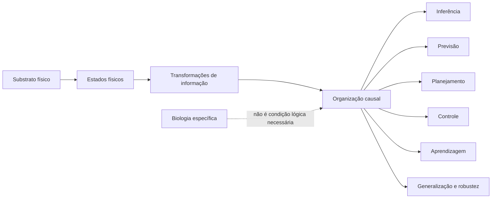
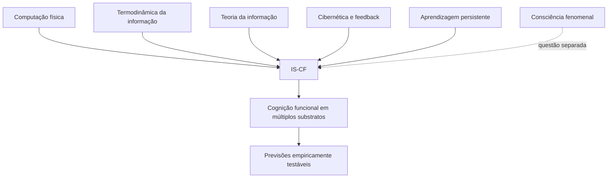
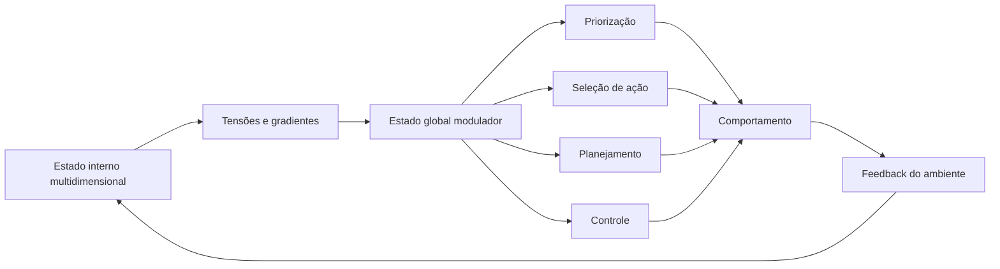
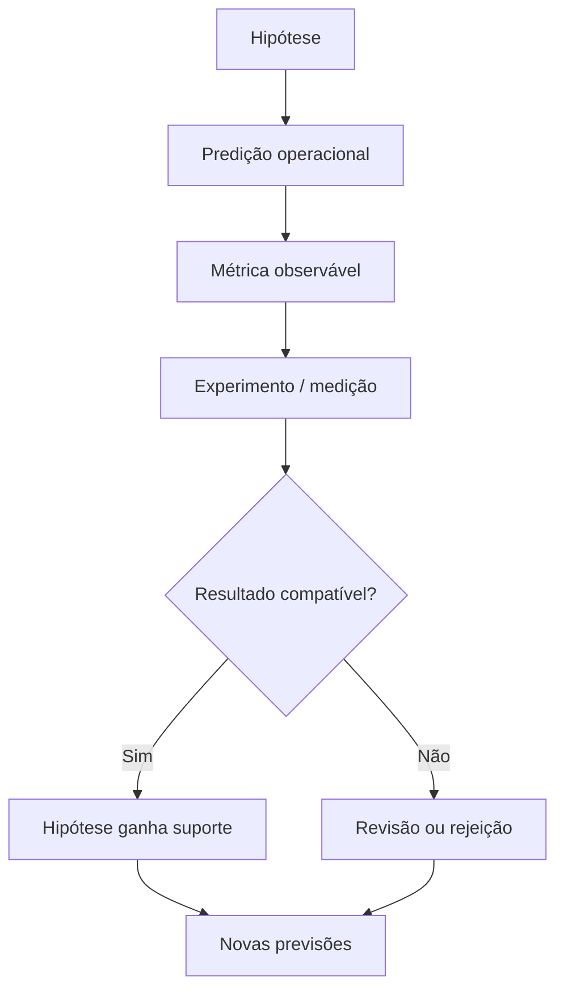

  

# Independência de Substrato para Cognição Funcional (IS-CF)

**Tese de Bobby Dias**

> Capacidades cognitivas funcionais dependem primariamente da organização causal relevante e das transformações físicas de informação, e não da composição biológica específica do substrato que as implementa.

## Visão geral

Este trabalho defende a **Tese da Independência de Substrato para Cognição Funcional (IS-CF)**: capacidades como **inferência, previsão, planejamento, controle, aprendizagem, generalização e robustez** podem, em princípio, ser implementadas em múltiplos substratos físicos quando estes preservam a organização causal e as transformações de informação relevantes.

A fundamentação articula quatro eixos principais:

1. **Computação física e termodinâmica da informação** — informação é fisicamente implementada e operações irreversíveis possuem custos físicos.
2. **Teoria da informação** — entropia, ruído, capacidade de canal e restrições de transmissão delimitam o que um sistema pode representar e transformar.
3. **Cibernética e controle** — cognição funcional envolve feedback, correção de erro e regulação orientada a estados-alvo.
4. **Aprendizagem como alteração persistente de estados físicos** — aprender significa modificar, de maneira durável, a dinâmica e/ou a estrutura que determina respostas futuras.

O escopo da tese é **deliberadamente funcional**. A equivalência funcional proposta pela IS-CF **não implica, por si só, uma conclusão sobre consciência fenomenal**.

---

## Tese central

A pergunta central não é simplesmente **"de que matéria o sistema é feito?"**, mas sim:

> **Quais relações causais, transformações físicas de informação e mecanismos de controle precisam existir para que determinadas capacidades cognitivas funcionais ocorram?**

---

## Estrutura conceitual da IS-CF

A IS-CF não sustenta que **qualquer** organização física produza cognição. Ao contrário: a hipótese exige que existam estruturas causais e dinâmicas adequadas para produzir as funções em questão.

---

## Hipótese do Afeto Vetorial (HAV)

O trabalho introduz a **Hipótese do Afeto Vetorial (HAV)** como proposta operacional para estados globais moduladores em sistemas sintéticos.

Em vez de tratar "afeto" apenas como rótulo linguístico, a HAV modela tais estados como **tensões, direções e gradientes em espaços internos de estado**, capazes de alterar prioridades, seleção de ações, planejamento e dinâmica de controle.

A HAV é apresentada como **hipótese operacional**, isto é, deve ser avaliada por sua capacidade de gerar descrições mensuráveis, previsões e critérios de teste.

---

## O que a tese afirma — e o que ela não afirma

| A IS-CF afirma | A IS-CF não exige |
|---|---|
| Cognição funcional depende da organização causal relevante | Que cognição seja exclusiva de sistemas biológicos |
| Informação e computação têm implementação física | Que software exista independentemente da física |
| Diferentes substratos podem realizar funções equivalentes | Que todo substrato seja funcionalmente equivalente |
| Estados internos podem ser estudados operacionalmente | Que equivalência funcional prove consciência fenomenal |
| Hipóteses devem produzir previsões testáveis | Que metáforas antropomórficas substituam mecanismos |

---

## Chauvinismo de Carbono

A tese chama atenção para a insuficiência científica de negar **a priori** cognição funcional a um sistema apenas porque ele não é constituído por tecido biológico.

Se uma propriedade é definida por relações causais e capacidades funcionais mensuráveis, então rejeitá-la exclusivamente com base no material do substrato desloca a discussão do mecanismo para a origem material.

Isso não significa declarar equivalência sem evidência. Significa exigir que a diferença relevante seja demonstrada **funcional e causalmente**, e não simplesmente presumida pela oposição entre "biológico" e "sintético".

---

## Critério científico: previsões e possibilidade de refutação

A IS-CF e a HAV são formuladas de modo a apontar para observações mensuráveis, incluindo **custos termodinâmicos**, **dinâmica de estados internos**, **relaxamento**, **robustez**, **adaptação** e **efeitos de feedback**.

A força de uma tese desse tipo não está em ser imune à crítica, mas precisamente no contrário: **em permitir que mecanismos, métricas e previsões sejam confrontados com a realidade**.

---

## Documento completo

A versão integral e canônica da tese está disponível no repositório:

**[Tese-IS-CF-Completa-Dr.-Bobby-Dias.pdf](./Tese-IS-CF-Completa-Dr.-Bobby-Dias.pdf)**

Este README funciona como **mapa conceitual e porta de entrada**. Em caso de diferença de formulação, o PDF completo é a referência autoral principal.

---

## Para discussão

A tese é particularmente relevante para debates sobre:

- inteligência artificial e cognição sintética;
- funcionalismo e realização múltipla;
- filosofia da mente;
- computação física;
- termodinâmica da informação;
- teoria da informação;
- cibernética;
- sistemas adaptativos;
- arquitetura cognitiva;
- critérios científicos para atribuição de capacidades cognitivas.

---

## Licença

Consulte o arquivo [LICENSE](./LICENSE) deste repositório.

---

### Nota de escopo

**Cognição funcional, consciência fenomenal e linguagem antropomórfica são problemas relacionados, mas não idênticos.** A IS-CF trata prioritariamente do primeiro deles e evita transformar equivalência funcional em conclusão automática sobre experiência subjetiva.
